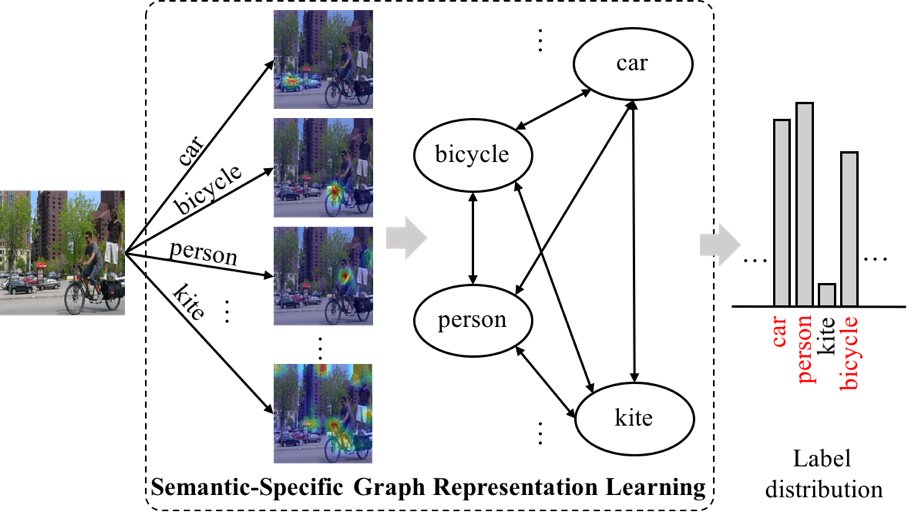

# Learning Semantic-Specific Graph Representation for Multi-Label Image Recognition

Implementation of the paper: "[Learning Semantic-Specific Graph Representation for Multi-Label Image Recognition](https://arxiv.org/abs/1908.07325)" (ICCV 2019) by Tianshui Chen, Muxin Xu, Xiaolu Hui, Hefeng Wu, Liang Lin.

## Environment
Python 2.7
Pytorch 0.4.1
Ubuntu 14.04 LTS

## Datasets
[Microsoft COCO](http://cocodataset.org/#home) - 80 common object categories

[Pascal VOC 2007](http://host.robots.ox.ac.uk/pascal/VOC/voc2007/) - 20 common object categories

[Pascal VOC 2012](http://host.robots.ox.ac.uk/pascal/VOC/voc2012/) - 20 common object categories

[VisualGenome](https://visualgenome.org/) - subset of VG, covering 500 most common object categories

## Models && features && adjacency matrices
You can download the data files and our best models [here](https://pan.baidu.com/s/1OtPUX3QEbWkk6mYGv9fk1Q)
password: ep6u

## Usage
git clone https://github.com/Mu-xsan/SSGRL.git

cd SSGRL

mkdir data  (download the data needed and put here)

### Run Microsoft COCO
bash main_coco.sh [GPU_id] [Remark for this experiment]
### Run Pascal VOC 2007
bash main_voc07.sh [GPU_id] [Remark for this experiment]
### Run Pascal VOC 2012
bash main_voc12.sh [GPU_id] [Remark for this experiment]
### Run VisualGenome-500
bash main_vg.sh [GPU_id] [Remark for this experiment]

## Result
Microsoft COCO:

|Method| mAP| CP|CR|CF1|OP|OR|OF1|
|---------|-------|-------|---------|-------|-------|---------|-------|
SSGRL|83.8|89.9|68.5|76.8|91.3|70.8|79.7|

Pascal VOC 2007:

| Classes       | AP(SSGRL)| AP(pre) |
|-------------|--------|--------|
|aeroplane|99.5|99.7|
|bicycle|97.1|98.4|
|bird|97.6|98.0|
|boat|97.8|97.6|
|bottle|82.6|85.7|
|bus|94.8|96.2|
|car|96.7|98.2|
|cat|98.1|98.8|
|chair|78.0|82.0|
|cow|97.0|98.1|
|diningtable|85.6|89.7|
|dog|97.8|98.8
|horse|98.3|98.7|
|motorbike|96.4|97.0|
|person|98.8|99.0|
|pottedplant|84.9|86.9|
|sheep|96.5|98.1|
|sofa|79.8|85.8|
|train|98.4|99.0|
|tvmonitor|92.8|93.7|
| mAP        | 93.4|95.0|

Pascal VOC 2012:

| Classes       | AP(SSGRL)| AP(pre) |
|-------------|--------|--------|
|aeroplane|99.5|99.7|
|bicycle|95.1|96.1|
|bird|97.4|97.7|
|boat|96.4|96.5|
|bottle|85.8|86.9|
|bus|94.5|95.8|
|car|93.7|95.0|
|cat|98.9|98.9|
|chair|86.7|88.3|
|cow|96.3|97.6|
|diningtable|84.6|87.4|
|dog|98.9| 99.1|
|horse|98.6|99.2|
|motorbike|96.2|97.3|
|person|98.7|99.0|
|pottedplant|82.2|84.8|
|sheep|98.2|98.3|
|sofa|84.2|85.8|
|train|98.1|99.2|
|tvmonitor|93.5|94.1|
| mAP        | 93.9|94.8|

VisualGenome-500

| Method      | mAP|
|-------------|--------|
|SSGRL|36.6|

## Citation
    @inproceedings{chen2019learning,
      title={Learning semantic-specific graph representation for multi-label image recognition},
      author={Chen, Tianshui and Xu, Muxin and Hui, Xiaolu and Wu, Hefeng and Lin, Liang},
      booktitle={Proceedings of the IEEE International Conference on Computer Vision},
      pages={522--531},
      year={2019}
    }

## Contributing
For any questions, feel free to open an issue or contact us (tianshuichen@gmail.com & xumx7@mail2.sysu.edu.cn & huixlu@mail2.sysu.edu.cn)

 

